# Analysis on consistent hashing 

<!-- toc -->

### Hash
What’s hash ?  
> Hash just is a map function from a set to another set, we can find a value of Set-B by use of a key of Set-A through hash function.

Hash function  
> The idea of hashing is to distribute the entries (key/value pairs) across an array of buckets. Given a key, the algorithm computes an index that suggests where the entry can be found:   
     **index = f(key, array_size)**
     
Hash table
>Hash table is equivalent to hash map.  
Hash table is a data structure used to implement an associative array, a structure that can map keys to values.   
Hash table uses a hash function to compute an index into an array of buckets or slots, from which the desired value can be found.
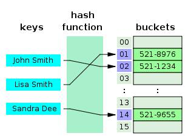
### Consistent Hashing

**Consistent hashing** is a special kind of hashing such that when a hash table is resized and consistent hashing is used, only K/n keys need to be remapped on average, where K is the number of keys, and n is the number of slots. 

The consistent hashing concept applies to the design of **distributed hash table** (DHT). In contrast, in most **traditional hash tables**, a change in the number of array slots causes nearly all keys to be remapped.

### Algorithm
1. Arrange key namespace   
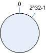
2. Map object to key namespace   
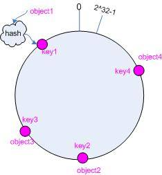
3. Map cache to key namespace    
4. Map the object to cache    
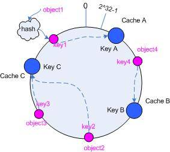
5. Remove a cache  
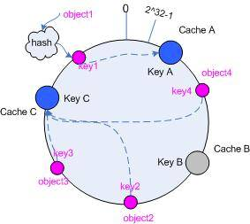
6. Add a cache   
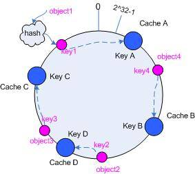
 
**New problem : Balance issue**  

1. Balance is that the result of hashing could assign to all caches as possible as evenly.    
- But hash algorithm can’t assure the absolute balance. Since it is essentially random and possible to have a very non-uniform distribution of objects between caches.  
- The solution to this problem is **virtual nodes**.

### Virtual Nodes

- **Virtual nodes** are replicas of cache points in the circle.
- One cache point maps some virtual points, So whenever we add a cache we create a number of virtual points in the circle for it.
- Virtual nodes are arranged according to hash value among the hash namespace.

**For example** : 

Cache A1 and A2 are for cache A  
Cache C1 and C2 are for cache C

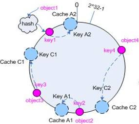

**Object -> virtual nodes**  
object1->cache A2 object2->cache A1  
object3->cache C1 object4->cache C2
      
**Object -> cache points**  
object1,2->cache A object3,4->cache C

After importing virtual nodes, the map relation is changed from “object to cache” to “object to virtual node”.

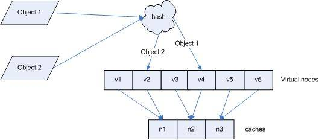

### Distributed Hash Table

**A distributed hash table** is a class of a decentralized distributed system that provides a lookup service similar to a hash table.

DHTs characteristically emphasize the following properties:    
**Autonomy, Decentralization, Fault tolerance, Scalability**

Structure: A **keyspace partitioning** scheme splits ownership of this keyspace among the participating nodes. An **overlay network** then connects the nodes, allowing them to find the owner of any given key in the keyspace.

**Storage and retrieval** :

Suppose the keyspace is the set of 160-bit strings. To store a file with given *filename* and *data* in the DHT, the **SHA-1** hash of *filename* is generated, producing a 160-bit key *k*, and a message *put(k, data)* is sent to any node participating in the DHT. The message is forwarded from node to node through the **overlay network** until it reaches the single node responsible for key *k* as specified by the keyspace partitioning. That node then stores the key *k* and the *data*. 

Any other client can then retrieve the contents of the file by again hashing *filename* to produce *k* and asking any DHT node to find the data associated with *k* with a message *get(k)*. The message will again be routed through the **overlay network** to the node responsible for *k*, which will reply with the stored *data*.

**Example**: Resolving key 26 from node 1 and key 12 from node 28 in a DHT system.  

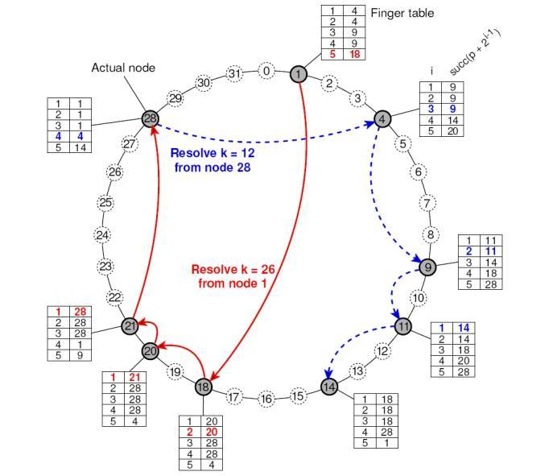
### Usage
#### 1. Memcache
Memcache is a **distributed cached system**.

The core design of distributed cached system is the balanced distribution of key and the minimum change when add or remove a cache server.

Memcache uses **KETAMA**( a consistent hashing algorithm) to choose the location where the data should store.

```
 public class KetamaHash : HashAlgorithm{                                
 // the code of HashAlgorithm refers to https://msdn.microsoft.com/
 // library/system.security.cryptography.hashalgorithm(v=vs.110).aspx
 
        private static readonly uint FNV_prime = 16777619;
        private static readonly uint offset_basis = 2166136261;
        protected uint hash;

        public KetamaHash(){  HashSizeValue = 32;}
        public override void Initialize(){  hash = offset_basis;}


        // routes data written to the object into the hash 
        // algorithm for computing the hash.
        protected override void HashCore(byte[] array, int ibStart, int cbSize){  
			int length = ibStart + cbSize;                                                                     
            for (int i = ibStart; i < length; i++){
                hash = (hash * FNV_prime) ^ array[i];
            }
        }
        // finalizes the hash computation after the last data is processed by 
        // the cryptographic stream object.
        protected override byte[] HashFinal(){  
            hash += hash << 13;      
            hash ^= hash >> 7;
            hash += hash << 3;
            hash ^= hash >> 17;
            hash += hash << 5;
            return BitConverter.GetBytes(hash);
        }
  }
```

#### 2. Amazon’s Dynamo
Dynamo is a highly available key-value storage system that some of Amazon’s core services use to provide an “always-on” experience.

Data in Dynamo is partitioned and replicated using consistent hashing, Dynamo uses it to partition its key space across its replicas and to ensure uniform load distribution.

The right figure shows the partitioning and replication of keys in Dynamo ring.
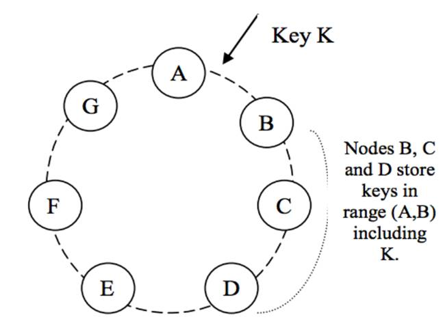

The architecture of amazon is distributed and decentralized completely.

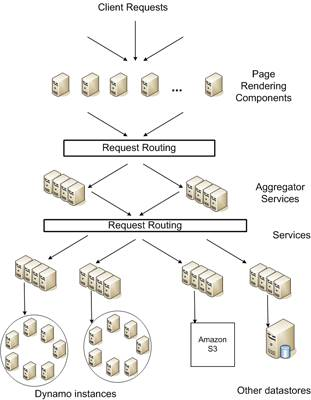

#### 3. Swift

1. The **OpenStack** Object Store project, known as Swift, offers cloud storage software so that you can store and retrieve lots of data with a simple API.  
 
- Swift is built for scale and optimized for durability, availability, and concurrency across the entire data set. It is ideal for storing **unstructured data** that can grow without bound.  
- Swift uses the principle of consistent hashing. It builds some **rings**, a ring represents the space of all possible computed hash values divided in equivalent parts. Each part of this space is called a **partition**.

- In Swift, there is 3 categories of thing to store: account, container and objects.
- An **account** just is a user account. An account contains **containers** (the equivalent of Amazon S3's buckets). Each container can contains user-defined key and values (just like a hash table or a dictionary): values are what Swift call **objects**.
- Swift wants you to build 3 different and independent **rings** to store its 3 kind of things (accounts, containers and objects).
- This 3 rings can be stored and managed on 3 completely different set of servers.

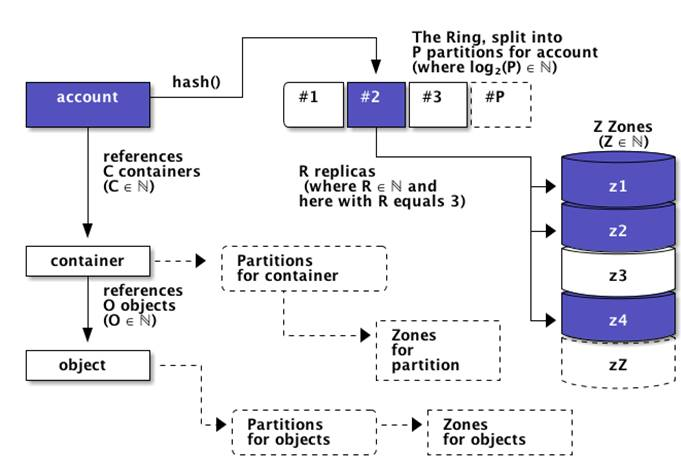

> When you put something in one of the 3 rings (an account, a container or an object), it is uploaded into all the zones responsible for the ring partition the object belongs to. 
> This upload into the different zones is the responsibility of the swift-proxy daemon
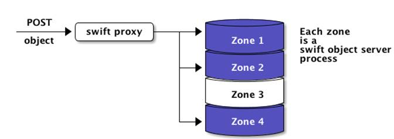

### Reference

- [Consistent Hashing and Random Trees: Distributed Caching Protocols for Relieving Hot Spots on the World Wide Web 1997](https://www.akamai.com/us/en/multimedia/documents/technical-publication/consistent-hashing-and-random-trees-distributed-caching-protocols-for-relieving-hot-spots-on-the-world-wide-web-technical-publication.pdf)
- [Consistent hashing  2009](http://michaelnielsen.org/blog/consistent-hashing)
- [Consistent hashing by Tom White  2007](http://www.tom-e-white.com/2007/11/consistent-hashing.html)
- [How Automatic Sharding Works or Consistent Hashing Under the Hood  2013](http://ivoroshilin.com/2013/07/15/distributed-caching-under-consistent-hashing/)
- [Distributed hash table - Wikipedia, the free encyclopedia](https://en.wikipedia.org/wiki/Distributed_hash_table)
- [Scalable, Distributed Data Structures for Internet Service Construction  2000](https://www.usenix.org/legacy/events/osdi00/full_papers/gribble/gribble.pdf)
- [http://xiexiejiao.cn/java/memcached-consistent-hashing.html  2010](http://xiexiejiao.cn/java/memcached-consistent-hashing.html)
- [Dynamo: Amazon’s Highly Available Key-value Store 2007](http://www.allthingsdistributed.com/files/amazon-dynamo-sosp2007.pdf)
- [Swift Tech Overview  2012](http://programmerthoughts.com/openstack/swift-tech-overview/)
- [OpenStack Swift eventual consistency analysis & bottlenecks  2012](https://julien.danjou.info/blog/2012/openstack-swift-consistency-analysis)
- [Modified Consistent Hashing Rings in OpenStack Swift 2014](https://ihong5.wordpress.com/tag/consistent-hashing-algorithm/)
